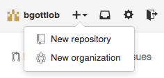
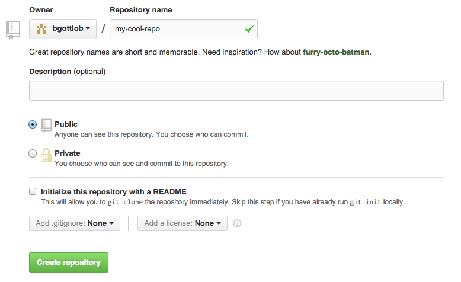

#Basic Git Tutorial 9/17/14

##What is Git and GitHub?
- Git is a version control system
  - Essentially, it stores various snapshots of your project, called commits, over time
  - Each commit can be accessed and restored at any time
- A Git repository, or repo, is simply a directory that your project is stored
  - Each time you create a commit to git, git saves a snapshot of your entire repo
- GitHub is a web-based service that allows you to publish Git repos online
  - This allows for streamlined collaboration on projects
  - It is a great backup tool that allows you to store and access your projects from any machine that has an internet connection
  - Git repos on GitHub can be public or private
  - GitHub has quickly become an outlet for open-source projects
- Git can be used without GitHub
  - Using Git alone would only store commits of your repo on your local machine
  - Git can alternatively be used with Dropbox or other cloud services, but GitHub is built to work with Git and is the best option for hosting Git reposa and managing collaboration

##Initializing a Git Repository
1. Create a new directory for your project in your file system
2. Navigate to the newly created directory on the command line
3. Initialize a git repository using the command `git init`
4. Go to [GitHub](http://github.com)
5. Sign in and create a new repository
  
6. Name your repo and give it a description (you don't have to worry about creating a README right away), then click "Create Repository"
  
7. Go back to your command line, make sure you are in the directory where you initialized your repo, create a file, add it, then commit it (details on what that actually means are coming up!)
  1. Create one or more files in the repo - you can use `touch fileName` on the command line if you want
  2. Add all files to the staging area with `git add *`
  3. Commit the files with `git commit -m "Initial commit"`
  4. Link the repo on you initialized on your local machine with the one you just created on GitHub with `git remote add origin theURLofYourGHrepo`
  5. Publish the files on GitHub with `git push origin master`
8. Go back to GitHub in your browser and refresh the page - you should see the files from your repo there!

##The Staging Area
- Before new files, file deletions, or file modifications can be committed, they must be added to the staging area
- The staging area is simply a list of changes that will be logged in the next commit
  - You won't always want to commit every change
- Use `git status` to show all of the changes you have made since your last commit and see which ones are in the staging area
- To add changes to the staging area, use `git add file1 file2 ...`
- To add all changes (excluding file deletions), use `git add *`
- To add file deletions to the staging area, use `git rm file1 file2 ...`

##Committing and Pushing to GitHub
- To commit the changes you have made to the project, use `git commit -m "Commit message"`
  - The commit message should briefly describe the changes you have made in that commit
  - If you don't provide a valid commit message, Git will open up your default command line text editor, so don't panic and just learn the key command to quit it, then try committing again
- To push the commit to GitHub, use `git push remoteName branchName`
  - Right now, your remote name is origin (that is just a pointer to your corresponding repo on GitHub) and your branch is master (more on that next)
  - So for right now, use `git push origin master`

##Branching
- When you are collaborating with others on a project, multiple people can be working at the same time (potentially on the same specific file at the same time)
- Creating a new branch for yourself before you start making commits puts your repo on your own timeline of commits
- The master branch is the main timeline for the repo - when you are collaborating, pushing directly to the master branch can overwrite someone else's changes
- To create a branch, use `git branch branchName`
- To switch to a branch, use `git checkout branchName`
- To create a branch and switch to it in one command, use `git checkout -b branchName`
- To view all of your local repo's branches, use `git branch`
- If you created a branch called `foo` you would push to it using `git push origin foo`
- Get in the habit of pushing to new branches and refrain from pushing directly to the master branch
- When you push a branch, go to your repository on GitHub in your browser and you will see that a pull request was created
  - Click on the button to automatically merge the branch into the master branch to prevent anyone's changes from being overwritten
  - Sometimes, merges can't be done automatically, which will result in a merge conflict, but don't worry about those until one actually occurs
